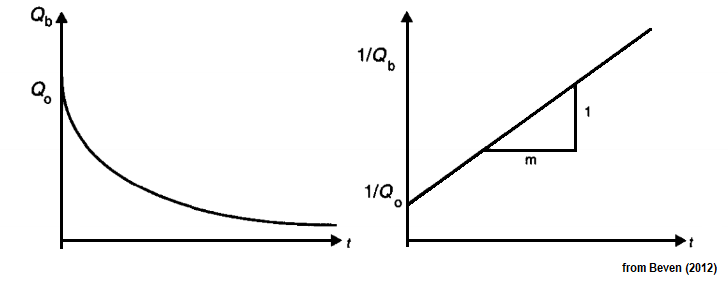

### Automated stream flow (linear decay) recession coefficient computation:

The stream flow recession coefficient (k), describes the withdrawal of water from storage within the watershed (Linsley et.al., 1975).  The recession coefficient is a means of determining the amount baseflow recedes after a given period of time:

$$ b_t=kb_{t-1} $$

where *bt−1* represents the stream flow calculated at one time step prior to *bt* where *bt−1*<*bt*.

<!-- (Note, this assumes that total flow measurements are reported at equal time intervals, when unequal intervals are used, *k∆t* must be used, where *∆t* is the time interval between successive *b* calculations relative to the time step *k* was calculated at.) -->

Another interpretation is rate-of-change in discharge $[\text{m}^3\text{s}^{-1}\text{day}^{-1}]$:

$$ \Delta b = \frac{b_t-b_{t-1}}{\text{(1 day)}} \approx (k-1)b$$

By plotting *bt−1* vs. *bt*, the recession coefficient can be determined by finding a linear function through the origin that envelopes the scatter above where *bt−1*/*bt* approaches unity. Here is where *k* is equivalent to the function's slope.

The reasoning here is that where the difference between *bt−1* and *bt* is minimized, then those stream flow values are most-likely solely composed of baseflow, i.e., *"the withdrawal of water from storage within the watershed"* (Linsley et.al., 1975). Where *bt−1*/*bt* $\ll$ 1, it is an indication that stream flow has a larger runoff/quickflow component, and thus cannot be considered a period of baseflow recession. 

The recession coefficient is computed automatically using an iterative procedure whereby the recession curve is positioned to envelope the log-transformed discharge data versus subsequent discharge, on the condition that the former exceeds the latter.

#### Note:

By updating the plot to a user-defined stream flow recession coefficient, all *k*-dependent calculations used on the sHydrology web app will be affected; otherwise the automated recession coefficient is used by default.

  

### Automated first-order (inverse) hyperbolic stream flow recession coefficient computation:

An alternative variant to the recession coefficient that assumes that stream flow follows an inverse hyperbolic function of the form: $$ \frac{1}{Q}-\frac{1}{Q_0}=\frac{t}{m} $$

where *1/Q* is the inverse discharge and *1/Q0* is the inverse of discharge at the beginning of a period of stream flow recession. The inverse of the slope of this function yields a first-cut estimate of the *m* parameter used in TOPMODEL (Beven and Kirkby, 1979).

This equation is solved by isolating a number of recession events that appear to fit a similar trend. These inverted stream flow recession events are then plotted against the duration of the event and a final linear regression model is determined. The regression model should only be used when it appears that the underlying recession curves are roughly parallel to the final regression line.

#### References

Beven, K.J., M.J. Kirkby, 1979. A physically based, variable contributing area model of basin hydrology. Hydrological Sciences Bulletin 24(1): 43-69.

Beven, K.J., 2012. Rainfall-Runoff modelling: the primer, 2\textsuperscript{nd} ed. John Wiley \& Sons, Ltd. 457pp.

Linsley, R.K., M.A. Kohler, J.L.H. Paulhus, 1975. Hydrology for Engineers 2nd ed. McGraw-Hill. 482pp.
