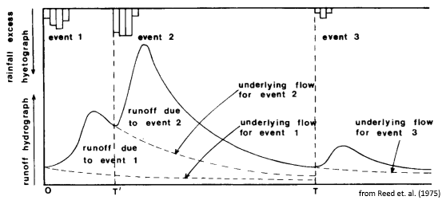

## Hydrograph Disaggregation

This algorithm is used to parse the hydrograph into three main constituents:

1.	The rising limb – the rapid increase in discharge following a storm/melt event;
2.	The falling limb – the rapid decrease in discharge following the rising limb; and,
3.	Streamflow recession – the gradual decline in discharge as the watershed drains.

### Event yields

Event yields are calculated using an algorithm that locates the onset of a rising limb and projects streamflow recession as if the event had never occurred. This projected streamflow, termed "underlying flow" by Reed et.al. (1975), is subtracted from the total observed flow to approximate the runoff volume associated with the event as indicated by the hydrograph. The calculation of event yields, in effect, "discretizes" the continuous hydrograph such that it can be better compared with measured (i.e., rainfall/smowmelt) event volumes.

